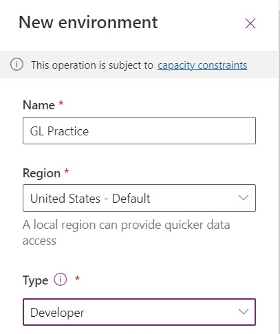
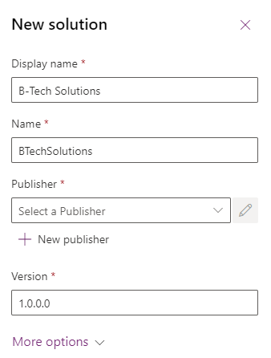
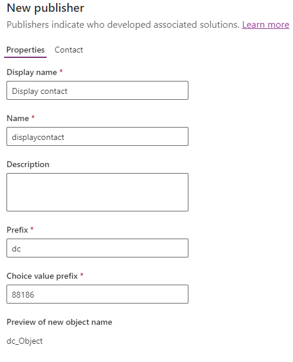

# Challenge 0: Building the infrastructure 

Before we start tackling the challenges, let's make sure we have everything set up and ready to go.

```Notes: Sign in to Power Platforms using the email and password provided to you.```

### Step 1: Sign in to Power Platforms
 

1.  Open a web browser and navigate to https://admin.powerplatform.microsoft.com/environments

2.  Sign in using your new Microsoft account that you want to use
    for this training

3.  Once signed in, click on \"Environments\" in the left navigation menu.

### Step 2: how to setup a new environment

1.In the Apps section, create a new environment:

1: Select **Environments** from the site navigation and select **+
New** from the toolbar

2: For **Name**, enter **\[your initials\] Practice**.
(Example: GL Practice)

3: For **Type**, select **developer**.




6: Select **Done** and select **Save**.

7: In the list of environments, your **Practice** environment should now
show as **Preparing**.

Your practice environment will take a few minutes to provision.
Refresh the **Environments** list if needed.

8: When your environment shows as **Ready**, You're good to go

### Step 3: Create publisher and solution


1: Navigate to the https://make.powerapps.com/ and make sure
you are in the practice environment you created.

2: From the left navigation pane, select **Solutions** and then select **+ New
solution**.

3: For **Display name**, enter **B-Tech Solutions**

4: Select **+ New publisher**, under the **Publisher** field.



5: Enter Display contact for **Display name**, displaycontact for
**Name**, DC for **Prefix**, 88186 for **Choice value prefix** and
select **Save**.



6: Select **Display contact (displaycontact)** from the **Publisher**
dropdown menu

7: Select **Create**.

## Success Criteria

- Present the Environment you created to your Coach
